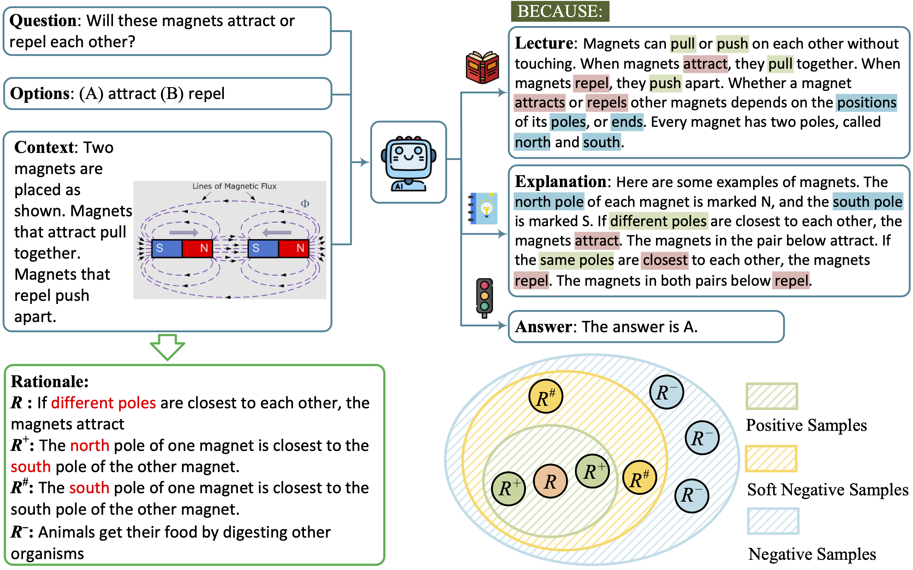

# Enhancing Semantics in Multimodal Chain of Thought via Soft Negative Sampling



Considering the same example in figure, an appropriate rationale is, *The **north** pole of one magnet is closest to the south of the other magnet*. However, simply modifying one word can make the rationale unreasonable, that is, *The **south** pole of one magnet is closest to the south of the other magnet*. For the decoder of generation, this inappropriate rationale can achieve an extremely low negative log-likelihood but will finally mislead the answer inference. 

## Requirements

Local python environment is 3.8, CUDA is 12.

Install all required python dependencies:
```
pip install -r requirements.txt
python
import nltk
nltk.download('punkt')
```

## Datasets

Download the dataset from the following repository:

```
https://github.com/lupantech/ScienceQA/tree/main/data
```

Download the extracted vision features from [vision_features](https://drive.google.com/file/d/13B0hc_F_45-UlqPLKSgRz-ALtFQ8kIJr/view?usp=share_link) and unzip the files under `vision_features`

## Instructions

### Training 
```
# rationale generation
CUDA_VISIBLE_DEVICES=0 python main.py \
    --data_root data/ScienceQA/data \
    --caption_file data/instruct_captions.json \
    --model google/flan-t5-base \
    --user_msg rationale --img_type detr \
    --bs 2 --eval_bs 4 --epoch 50 --lr 5e-5 --output_len 512 \
    --use_caption --use_generate --prompt_format QCM-E \
    --output_dir experiments \
    --enhance_LE

# answer inference
CUDA_VISIBLE_DEVICES=0 python main_central.py \
    --data_root data/ScienceQA/data \
    --caption_file data/instruct_captions.json \
    --model google/flan-t5-base \
    --user_msg answer --img_type detr \
    --bs 2 --eval_bs 4 --epoch 50 --lr 5e-5 --output_len 64 \
    --use_caption --use_generate --prompt_format QCMG-A \
    --output_dir experiments \
    --eval_le experiments/rationale_google-flan-t5-base_detr_QCM-E_lr5e-05_bs2_op512_ep50/predictions_ans_eval.json \
    --test_le experiments/rationale_google-flan-t5-base_detr_QCM-E_lr5e-05_bs2_op512_ep50/predictions_ans_test.json
```

### Inference 

```
# rationale generation
CUDA_VISIBLE_DEVICES=0 python main.py \
    --data_root data/ScienceQA/data \
    --caption_file data/instruct_captions.json \
    --model google/flan-t5-base \
    --user_msg rationale --img_type detr \
    --bs 2 --eval_bs 4  --epoch 50 --lr 5e-5 --output_len 512 \
    --use_caption --use_generate --prompt_format QCM-E \
    --output_dir experiments
    --evaluate_dir models/mm-cot-large-rationale

# answer inference
CUDA_VISIBLE_DEVICES=0 python main.py \
    --data_root data/ScienceQA/data \
    --caption_file data/instruct_captions.json \
    --model google/flan-t5-base \
    --user_msg answer --img_type detr \
    --bs 4 --eval_bs 8 --epoch 50 --lr 5e-5 --output_len 64  \
    --use_caption --use_generate --prompt_format QCMG-A \
    --output_dir experiments \
    --eval_le experiments/rationale_google-flan-t5-base_detr_QCM-E_lr5e-05_bs2_op512_ep50/predictions_ans_eval.json \
    --test_le experiments/rationale_google-flan-t5-base_detr_QCM-E_lr5e-05_bs2_op512_ep50/predictions_ans_test.json \
    --evaluate_dir models/mm-cot-large-answer
```

## Citing SNSE-CoT

```
@inproceedings{zheng-etal-2024-enhancing-semantics,
    title = "Enhancing Semantics in Multimodal Chain of Thought via Soft Negative Sampling",
    author = "Zheng, Guangmin  and
      Wang, Jin  and
      Zhou, Xiaobing  and
      Zhang, Xuejie",
    booktitle = "Proceedings of the 2024 Joint International Conference on Computational Linguistics, Language Resources and Evaluation (LREC-COLING 2024)",
    year = "2024",
    pages = "6059--6076",
}
```

## License

This project is licensed under the Apache-2.0 License.

## Acknowledgement
Part of our codes are adapted from [Multimodal-CoT](https://github.com/amazon-science/mm-cot), [ScienceQA](https://github.com/lupantech/ScienceQA), [Transformers](https://github.com/huggingface/transformers), [pytorch-image-models](https://github.com/huggingface/pytorch-image-models).

We thank [Pan Lu](https://lupantech.github.io/) for providing parameter size for ScienceQA
